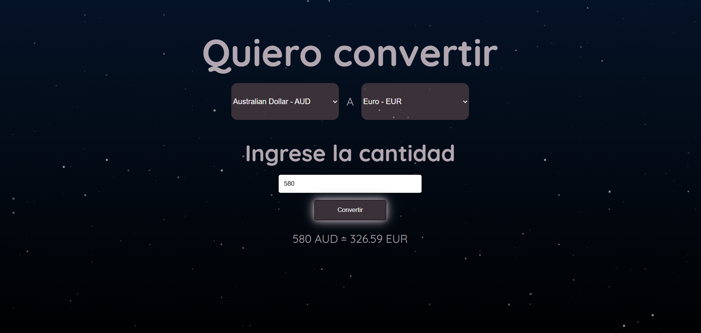

# Convertidor de Mondeas
Este  proyecto es un convertidor de  monedas que utiliza tasas de cambio actualizadas en tiempo real, obtenidas mediante una API.

## Objetivo

Desarrollar un convertidor de monedas, aplicando conocimientos en:

- consumo de APIs
- Manipulación del DOM
- Buenas practicas de programación

## Tecnologías Utilizadas
- HTML
- CSS
- JavaScript
- Git
- GitHub

## Componentes Principales

**Fondo animado estrellado:** Un fondo dinámico con animación de estrellas, creado con JavaScript. 

**Botón de conversión:** Permite invocar la función  que realiza el calculo y muestra el resultado de la conversión.

## Captura de Pantalla



## Como Ejecutar el Proyecto

1. clona este repositorio

<aside>
💡

```jsx
https://github.com/Licenia/convertidor-monedas.git
```

</aside>

1. Abre el archivo index.html en tu navegador.